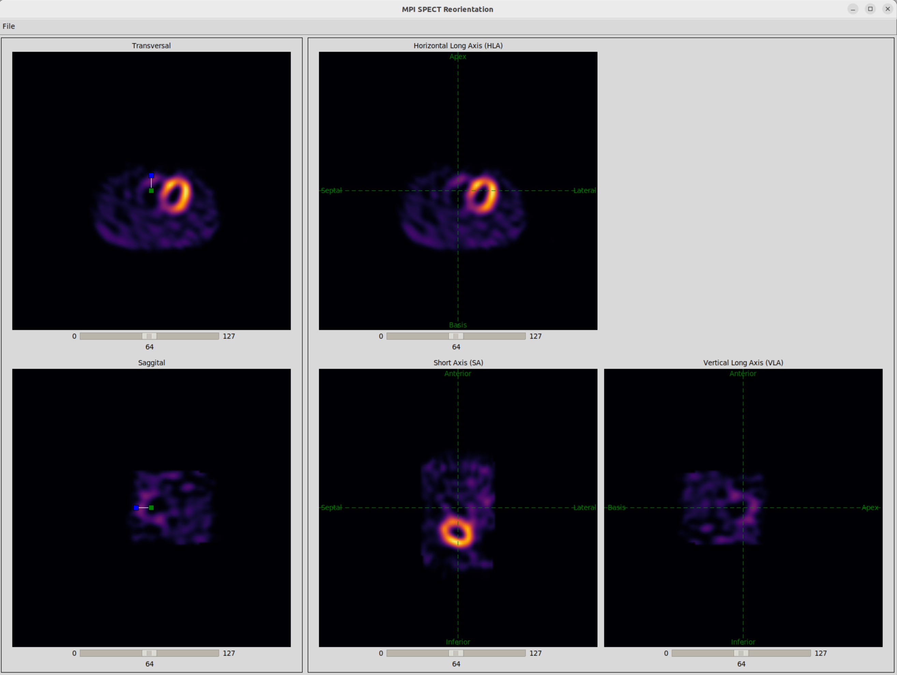
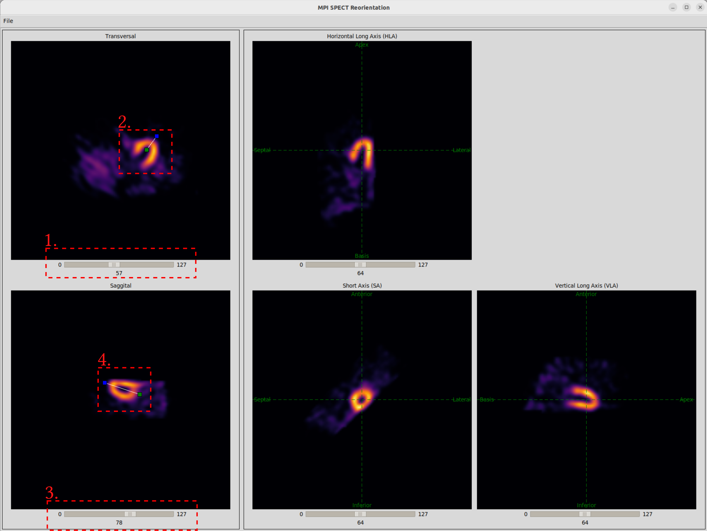

# MPI SPECT Reorientation
GUI for the manual reorientation of MPI SPECT images.

## Installation
1. (Optionally,) create and activate a virtual python environment: `python3 -m venv .venv && source .venv/bin/activate`
1. Install dependencies: `pip3 install -r requirements.txt`

## Usage
* Launch the application: `python -m reoriantation_gui`
* Select an MPI SPECT image using the file browser. You can chose another image using the File->Open menu item.
* You can either press `CTRL+s` or use the File->Save/Save as menu items to store the current reorientation parameters in a csv file.

### Reorientation Procedure
To reorient an MPI SPECT image follow the procedure described and illustrated below.
1. Use the slider of the transversal view to select the central transversal slice of the heart (the slice where the heart is larges).
1. Use the two rectangles to define the center of the heart and the rotation axis around the z-axis.
    1. Place the green rectangle at the heart center.
    1. Use the blue rectangle to define the long axis of the heart.
1. Use the slider of the sagittal view to select a slice where the heart is visible well.
1. Use both rectangles to define the long axis of the heart in this direction.

